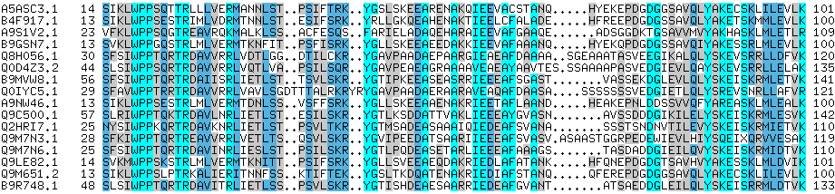

## Course Description

This is an **entry level** course in three parts, aimed at those with a reasonable biological background but no significant experience with bioinformatics.

The course content is designed to show how, by going through guided exercises, a researcher in the bio-medical area can access sequence data and steer his/her analysis to efficiently extract results, checking how credible they are and reason about using them confidently, in a reproducible way.

This course will also provide a soft introduction to Next Generation Sequencing (NGS) data analysis. This part of the course aims at providing basic skills that are needed when one needs to process NGS data, using open source bioinformatics tools.

Thirdly, the course will cover the broad theme of analytical automation, and how it enhances the capacity of researchers by widening the scope of their experiments, comparing results in a large scale and summarising the findings in simple but very reproducible ways.

## Target Audience

Researchers at any level, wishing to investigate how they might begin to exploit the ever expanding abundance of computing and data resources.

## Detailed Program

---

### [Learning objectives](./pages/objectives_prerequesites.md)

### [Instructors](instructors.md)

---

The source for this course webpage is [in github](https://github.com/GTPB/ELB20).

 

 ELB20 by GTPB is licensed under a <a rel="license" href="http://creativecommons.org/licenses/by/4.0/">Creative Commons Attribution 4.0 International License</a>.
